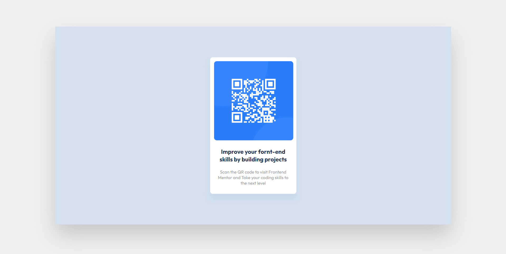
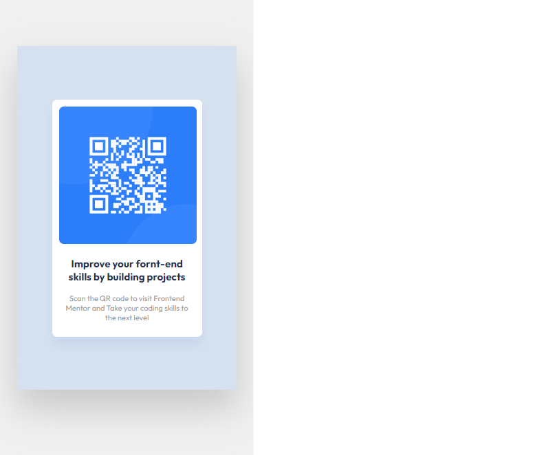

# Frontend Mentor - QR code component solution

This is a solution to the [QR code component challenge on Frontend Mentor](https://www.frontendmentor.io/challenges/qr-code-component-iux_sIO_H). Frontend Mentor challenges help you improve your coding skills by building realistic projects. 

## Table of contents

- [Overview](#overview)
- [Screenshot](#screenshot)
- [Links](#links)
  - [Author](#author)

## Overview
  Hello there!
  thanks for visiting my profile!
  If you have any thoughts, questions, or suggestions, I would love to hear from you!

## Screenshots

## Links

  - [Solution URL](https://manolyatam.github.io/QR-Code-Component/)
  - [Live Site URL](https://your-live-site-url.com)

### Author
  - Email - [Manolya Tamimi](tamimimanolya@gmail.com)
  - GitHub - [ManolyaTam](https://github.com/ManolyaTam/)
  - Frontend Mentor - [@yourusername](https://www.frontendmentor.io/profile/ManolyaTam)
